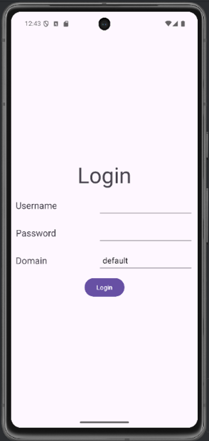
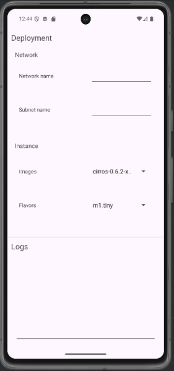

# NT553.P11.2 - Lab 2 - Task 2
## Overview
This is a repository of Lab 2 - Task 2 - NT533.P11.2 - A mobile application providing possibiliy to create Networks and Instances via self-deployed OpenStack's API
## UI Images

  
  
Login Screen

  
  
Main interaction screen

